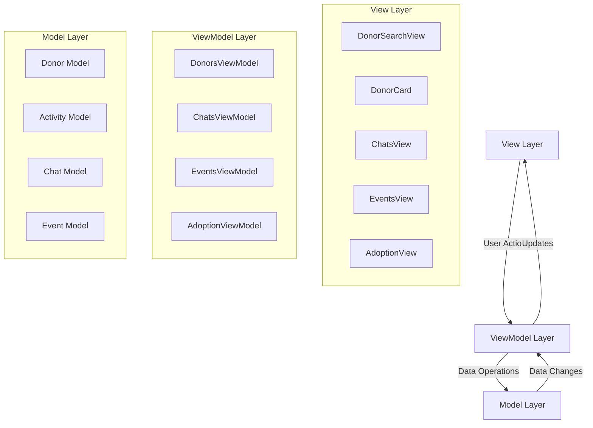
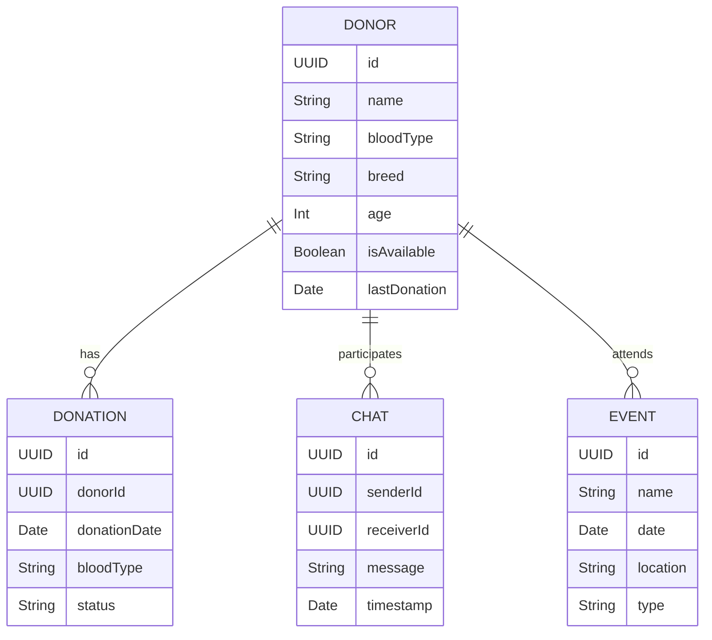

# Paw Safe Architecture Documentation

## MVVM Architecture Overview

Paw Safe follows the MVVM (Model-View-ViewModel) architecture pattern, which provides a clear separation of concerns and makes the code more maintainable and testable.

### Architecture Flowchart


### Entity Relationship Diagram


## Architecture Components

### 1. View Layer
- **DonorSearchView**: Main interface for searching donors
- **DonorCard**: Reusable component for displaying donor information
- **ChatsView**: Chat interface for communication
- **EventsView**: Event management interface
- **AdoptionView**: Pet adoption interface

### 2. ViewModel Layer
- **DonorsViewModel**
  - Manages donor data and search functionality
  - Handles filtering and sorting
  - Manages donor availability status

- **ChatsViewModel**
  - Manages chat functionality
  - Handles message history
  - Controls real-time updates

- **EventsViewModel**
  - Manages event data
  - Handles event registration
  - Controls event notifications

- **AdoptionViewModel**
  - Manages adoption process
  - Handles pet profiles
  - Controls adoption status

### 3. Model Layer
- **Donor Model**
  ```swift
  struct Donor: Identifiable {
      let id: UUID
      let name: String
      let bloodType: String
      let breed: String
      let age: Int
      let isAvailable: Bool
      let lastDonation: Date
  }
  ```

- **Activity Model**
  ```swift
  struct Activity: Identifiable {
      let id: UUID
      let type: ActivityType
      let timestamp: Date
      let description: String
  }
  ```

## Data Flow

1. **User Interaction Flow**
   - User interacts with View
   - View notifies ViewModel
   - ViewModel processes request
   - ViewModel updates Model
   - Model notifies ViewModel
   - ViewModel updates View

2. **Data Update Flow**
   - Model data changes
   - ViewModel observes changes
   - ViewModel updates its state
   - View reflects changes

## Key Features Implementation

### 1. State Management
- Uses `@Published` properties in ViewModels
- Implements `ObservableObject` protocol
- Uses `@State` and `@Binding` in Views

### 2. Data Binding
- Two-way binding between View and ViewModel
- Reactive updates using Combine framework
- Automatic UI updates on data changes

### 3. Navigation
- Hierarchical navigation structure
- Deep linking support
- State-based navigation

## Benefits of MVVM in Paw Safe

1. **Separation of Concerns**
   - Clear separation between UI and business logic
   - Easier maintenance and testing
   - Better code organization

2. **Testability**
   - ViewModels can be tested independently
   - Business logic is isolated from UI
   - Easier to write unit tests

3. **Reusability**
   - Components can be reused across the app
   - ViewModels can be shared between Views
   - Models are platform-independent

4. **Maintainability**
   - Clear structure makes code easier to maintain
   - Changes in one layer don't affect others
   - Easier to add new features 
