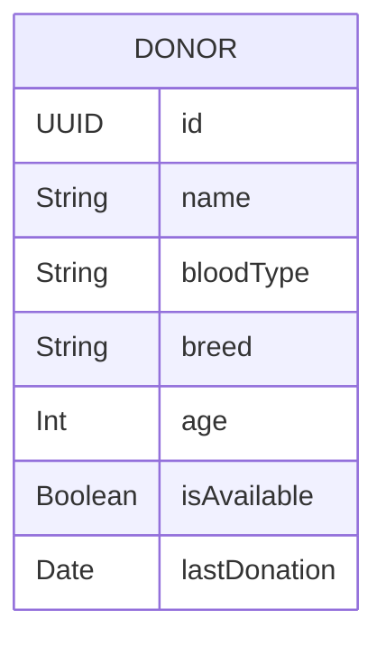
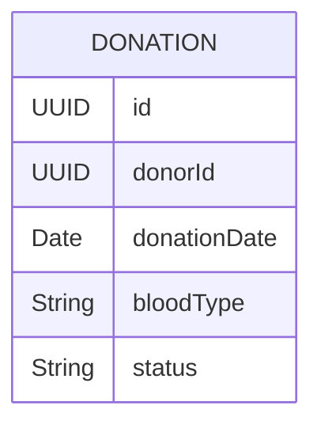
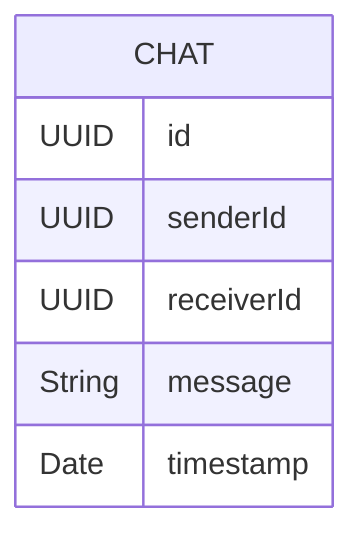
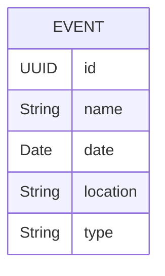
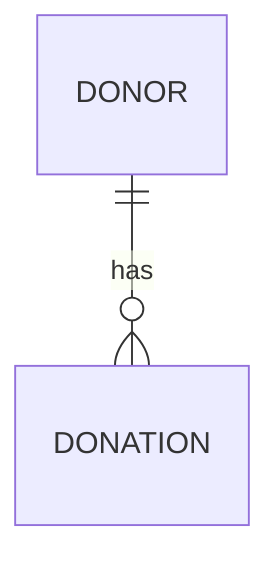
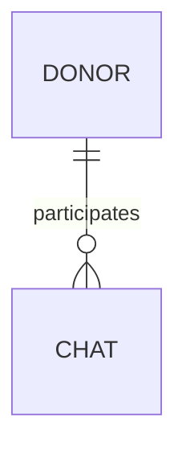
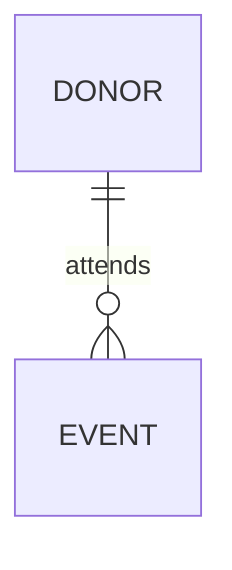

# Entity Relationship Diagram (ERD) Explanation for Paw Safe

## Overview
The ERD represents the core data entities in Paw Safe and their relationships. Here's a detailed breakdown:

## Core Entities

### 1. DONOR Entity

**Attributes:**
- `id`: Unique identifier for each donor
- `name`: Donor's name
- `bloodType`: Blood type of the donor
- `breed`: Breed of the donor
- `age`: Age of the donor
- `isAvailable`: Current availability status
- `lastDonation`: Date of last blood donation

### 2. DONATION Entity

**Attributes:**
- `id`: Unique identifier for each donation
- `donorId`: Reference to the donor
- `donationDate`: When the donation occurred
- `bloodType`: Type of blood donated
- `status`: Current status of the donation

### 3. CHAT Entity

**Attributes:**
- `id`: Unique identifier for each chat message
- `senderId`: ID of the message sender
- `receiverId`: ID of the message receiver
- `message`: Content of the message
- `timestamp`: When the message was sent

### 4. EVENT Entity

**Attributes:**
- `id`: Unique identifier for each event
- `name`: Name of the event
- `date`: When the event occurs
- `location`: Where the event takes place
- `type`: Type of event (e.g., blood drive, adoption)

## Relationships

### 1. DONOR to DONATION (One-to-Many)

- One donor can have multiple donations
- Each donation belongs to one donor
- Relationship is tracked through `donorId` in DONATION

### 2. DONOR to CHAT (One-to-Many)

- One donor can participate in multiple chats
- Each chat involves two donors (sender and receiver)
- Relationships are tracked through `senderId` and `receiverId`

### 3. DONOR to EVENT (One-to-Many)

- One donor can attend multiple events
- Each event can have multiple donors
- This is a many-to-many relationship

## Implementation in Swift

### 1. Donor Model
```swift
struct Donor: Identifiable {
    let id: UUID
    let name: String
    let bloodType: String
    let breed: String
    let age: Int
    let isAvailable: Bool
    let lastDonation: Date
    
    // Relationships
    var donations: [Donation]?
    var chats: [Chat]?
    var events: [Event]?
}
```

### 2. Donation Model
```swift
struct Donation: Identifiable {
    let id: UUID
    let donorId: UUID
    let donationDate: Date
    let bloodType: String
    let status: String
    
    // Relationship
    var donor: Donor?
}
```

### 3. Chat Model
```swift
struct Chat: Identifiable {
    let id: UUID
    let senderId: UUID
    let receiverId: UUID
    let message: String
    let timestamp: Date
    
    // Relationships
    var sender: Donor?
    var receiver: Donor?
}
```

### 4. Event Model
```swift
struct Event: Identifiable {
    let id: UUID
    let name: String
    let date: Date
    let location: String
    let type: String
    
    // Relationships
    var attendees: [Donor]?
}
```

## Database Considerations

1. **Primary Keys**
   - All entities use UUID as primary key
   - Ensures uniqueness across the system
   - Supports distributed systems

2. **Foreign Keys**
   - `donorId` in DONATION references DONOR
   - `senderId` and `receiverId` in CHAT reference DONOR
   - Event-Donor relationship is many-to-many

3. **Indexing**
   - Index on `donorId` in DONATION
   - Index on `senderId` and `receiverId` in CHAT
   - Index on `date` in EVENT

## Data Access Patterns

1. **Donor Queries**
   - Find donor by ID
   - Find donors by blood type
   - Find available donors

2. **Donation Queries**
   - Find donations by donor
   - Find recent donations
   - Find donations by status

3. **Chat Queries**
   - Find chats between two donors
   - Find recent chats
   - Find unread messages

4. **Event Queries**
   - Find upcoming events
   - Find events by location
   - Find events by type 
