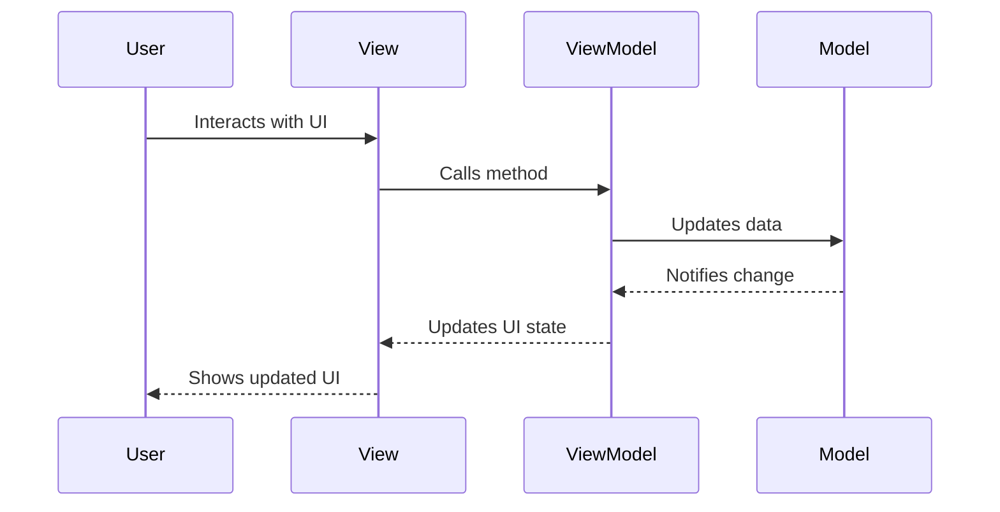
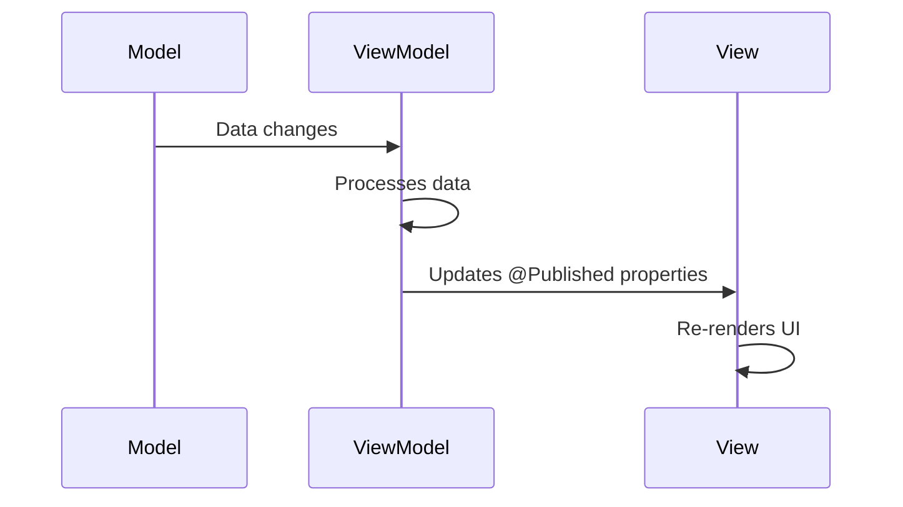

# Understanding MVVM Architecture in Paw Safe

## What is MVVM?

MVVM (Model-View-ViewModel) is an architectural pattern that separates an application into three main components:

1. **Model**: Represents the data and business logic
2. **View**: The user interface
3. **ViewModel**: Acts as a bridge between Model and View

## MVVM Components in Detail

### 1. Model Layer
```swift
// Example of a Model in Paw Safe
struct Donor: Identifiable {
    let id: UUID
    let name: String
    let bloodType: String
    let breed: String
    let age: Int
    let isAvailable: Bool
    let lastDonation: Date
}
```
- Contains pure data structures
- Represents business entities
- Independent of UI
- Handles data validation and business rules

### 2. View Layer
```swift
// Example of a View in Paw Safe
struct DonorSearchView: View {
    @StateObject private var viewModel = DonorsViewModel()
    
    var body: some View {
        VStack {
            SearchBar(text: $viewModel.searchText)
            DonorList(donors: viewModel.filteredDonors)
        }
    }
}
```
- Contains UI elements
- Declarative UI using SwiftUI
- Binds to ViewModel
- Handles user interactions

### 3. ViewModel Layer
```swift
// Example of a ViewModel in Paw Safe
class DonorsViewModel: ObservableObject {
    @Published var donors: [Donor] = []
    @Published var searchText: String = ""
    @Published var isLoading: Bool = false
    
    var filteredDonors: [Donor] {
        donors.filter { donor in
            searchText.isEmpty || 
            donor.name.localizedCaseInsensitiveContains(searchText)
        }
    }
    
    func fetchDonors() {
        isLoading = true
        // API call implementation
        isLoading = false
    }
}
```
- Manages UI state
- Handles business logic
- Processes user actions
- Updates Model and View

## Data Flow in MVVM

### 1. User Action Flow


### 2. Data Update Flow


## Key MVVM Concepts in Paw Safe

### 1. Data Binding
```swift
// Two-way binding example
struct DonorCard: View {
    @Binding var donor: Donor
    
    var body: some View {
        VStack {
            Text(donor.name)
            Text(donor.bloodType)
        }
    }
}
```

### 2. State Management
```swift
// State management in ViewModel
class DonorsViewModel: ObservableObject {
    @Published var donors: [Donor] = []
    @Published var selectedDonor: Donor?
    @Published var isLoading: Bool = false
}
```

### 3. Dependency Injection
```swift
// Dependency injection example
class DonorsViewModel: ObservableObject {
    private let donorService: DonorServiceProtocol
    
    init(donorService: DonorServiceProtocol = DonorService()) {
        self.donorService = donorService
    }
}
```

## Benefits of MVVM in Paw Safe

1. **Separation of Concerns**
   - UI logic is separate from business logic
   - Each component has a single responsibility
   - Easier to maintain and test

2. **Testability**
   - ViewModels can be tested independently
   - Business logic is isolated from UI
   - Easy to mock dependencies

3. **Reusability**
   - ViewModels can be shared between Views
   - Models are platform-independent
   - Components are loosely coupled

4. **Maintainability**
   - Clear structure makes code easier to maintain
   - Changes in one layer don't affect others
   - Easier to add new features

## Best Practices in Paw Safe's MVVM Implementation

1. **ViewModels**
   - Keep ViewModels focused and single-purpose
   - Use dependency injection for services
   - Handle all business logic

2. **Views**
   - Keep Views simple and declarative
   - Use SwiftUI's built-in state management
   - Implement reusable components

3. **Models**
   - Keep Models pure and simple
   - Use value types (structs) where possible
   - Implement proper data validation

4. **State Management**
   - Use `@Published` for observable properties
   - Implement proper error handling
   - Manage loading states effectively

## Common MVVM Patterns in Paw Safe

1. **Search Pattern**
```swift
class DonorsViewModel: ObservableObject {
    @Published var searchText: String = ""
    @Published var donors: [Donor] = []
    
    var filteredDonors: [Donor] {
        donors.filter { donor in
            searchText.isEmpty || 
            donor.name.localizedCaseInsensitiveContains(searchText)
        }
    }
}
```

2. **Loading State Pattern**
```swift
class DonorsViewModel: ObservableObject {
    @Published var isLoading: Bool = false
    @Published var error: Error?
    
    func fetchDonors() {
        isLoading = true
        // API call
        isLoading = false
    }
}
```

3. **Error Handling Pattern**
```swift
class DonorsViewModel: ObservableObject {
    @Published var error: Error?
    
    func handleError(_ error: Error) {
        self.error = error
        // Show error alert
    }
}
``` 
